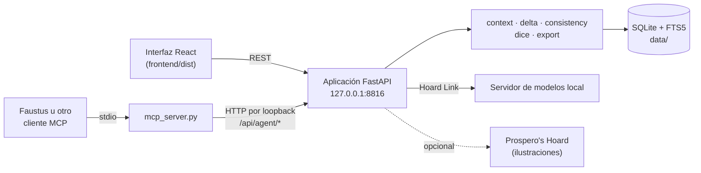

#  Scheherazade's Hoard
### ¿Quién sigue vivo? ¿Quién está dónde? ¿Qué les has prometido?
**Un guardián de la coherencia y el estado del mundo para ficción interactiva y partidas de rol — recuerda todo lo que un modelo de lenguaje olvida, y le da al narrador exactamente lo que necesita para la siguiente escena.**

[English](README.md) · [Inicio rápido](#inicio-rápido) · [Conectar con Faustus](#conectar-con-faustus) · [Referencia MCP](docs/MCP.md) · [Portfolio](https://luissalet.github.io/Portfolio/#projects)


*La aplicación real con datos de demostración sintéticos («El Archipiélago de Sal», un escenario original que genera `--demo`).*

## Por qué

Los modelos de lenguaje son buenos narrando y malísimos llevando la
continuidad. Después de una hora de ficción interactiva o una sesión de
rol olvidan quién sabe qué, resucitan personajes muertos, mueven pueblos
de sitio, pierden los hilos abiertos y se inventan las tiradas.
Scheherazade mantiene el **estado del mundo fuera del modelo** —
entidades, relaciones, secretos, lugares, una cronología, hilos abiertos,
relojes, tablas y un registro de dados auditado — y construye para el
narrador un resumen compacto, ordenado y con un presupuesto de caracteres
para la siguiente escena, y después registra lo que esa escena cambió de
verdad. Puede narrar por sí sola con un modelo local compartido, o ceder
sus herramientas a otra IA (Faustus) para que esa IA narre mientras esta
aplicación lo recuerda todo.

## Qué está implementado

| Área | Disponible ahora | Límite |
| --- | --- | --- |
| Estado del mundo | Entidades (personaje/lugar/facción/objeto/saber/criatura) con alias, estadísticas y secretos del máster, relaciones, hechos con procedencia y marca de canon, cronología, hilos, relojes y tablas aleatorias; SQLite + FTS5 con búsqueda que no distingue tildes | Un único escritor local; sin edición multiusuario |
| Dados | `NdM`, `+/-`, `kh/kl/dh/dl`, dados que explotan `!`, `adv(d20)`/`dis(d20)`, dados Fate `dF`; reproducibles con semilla; cada tirada queda en un registro de solo añadir; con un mundo, las tiradas de 2d6 traen su banda PbtA y las de d20 su valor natural y el crítico | Con topes a propósito (200 dados por tirada, 100 caracteres por expresión) |
| Constructor de contexto | `world_context()`: premisa, límites de contenido, escena y reparto actuales, hechos ordenados por relevancia, hilos vivos, relojes a partir de la mitad y últimos turnos, cada línea con un id citable y dentro de un presupuesto de caracteres | El orden es léxico y por reglas, no una búsqueda por embeddings |
| Motor de cambios (delta) | Validación elemento a elemento; después, el delta y su turno en una sola transacción de SQLite; la escena se mantiene de un turno a otro; deshacer retrocede turno a turno dentro de la sesión actual | No hay rehacer; los turnos de una sesión anterior no se pueden deshacer |
| Narrador (modo autónomo) | Construye el prompt, llama al modelo compartido a través de Hoard Link, separa la narración del delta (JSON en bloque o suelto; repara comillas tipográficas, comentarios, comas finales, un delta anidado bajo `"delta"` y una respuesta cortada por el límite de tokens, conservando los elementos completos), nunca deja JSON en la historia y te deja aceptar o rechazar cada cambio propuesto | Sin streaming: una respuesta, con indicador de carga |
| Comprobación de coherencia | Reglas para un personaje muerto que actúa, un personaje situado lejos de donde se le vio por última vez y una relación contradicha (por palabra completa y con alias), más un juez por IA sobre los hechos que coinciden, obligado a citar sus ids; el resultado indica si el juez ha intervenido | Son heurísticas: se le escapan las contradicciones que ninguna regla cubre y ningún hecho recoge |
| Exportación | Sesión como capítulo en Markdown listo para el manuscrito (sin ids, dados ni líneas fuera de personaje; acciones en cursiva; diálogo con raya), con pulido opcional por el modelo compartido (si no puede, devuelve el capítulo sin pulir y dice por qué), biblia del mundo en Markdown, exportación e importación completas en JSON | El pulido tiene instrucciones de no añadir hechos, pero no se contrasta con el original; los capítulos de más de 6000 caracteres no se pulen; un mundo importado conserva sus sesiones y turnos, pero no su historial de deshacer |
| Ilustraciones | «Ilustrar» llama a la API de agente de Prospero's Hoard cuando responde en 127.0.0.1:8815; si no, el botón no aparece | Necesita esa otra aplicación; la imagen se muestra, pero no se guarda en el turno |
| Backend de modelos compartido | Hoard Link incluido sin modificar (`scheherazades_hoard/hoard_link/`): primero la configuración explícita, luego el registro de modelos de Faustus y después los modelos ya cargados en local (llama.cpp, Ollama, servidores compatibles con OpenAI); Ajustes muestra el motivo, permite borrar la configuración manual y nunca devuelve el token | Solo se usa la capacidad de modelo de lenguaje; la aplicación nunca carga un modelo por su cuenta |
| Interfaz | Jugar (modos Narración/Acción/Diálogo/Fuera de personaje y un editor de escena para lugar, reparto y ambiente), Biblia (crear y editar: estado, resumen, apodos, etiquetas, secretos), Mapa de relaciones (SVG), Cronología, Hilos y relojes (kanban y relojes segmentados), Tablas, Sesiones (empezar, renombrar, exportar), Registro de dados, Backends, Actividad del asistente, Ajustes; comprobación de continuidad en Jugar; búsqueda sin tildes en la Biblia; en español e inglés, tema claro y oscuro | El mapa usa una disposición circular fija, no una simulación física |

## Casos de uso

Ocho escenarios para alguien que juega en solitario y además escribe,
recorridos en el navegador y por MCP antes y después de la revisión de
usabilidad ([docs/USE_CASES.md](docs/USE_CASES.md); hallazgos y un
veredicto por caso en [docs/USABILITY_REPORT.md](docs/USABILITY_REPORT.md)).
Entre ellos:

- **Primera noche sin modelo:** crear un mundo, su gente y sus lugares,
  fijar la escena y jugarla a mano, con dados.
- **Una noche larga narrada por un modelo local a través de Faustus:** 44
  turnos en español en los que los muertos siguen muertos, cada cual
  sigue donde se le vio por última vez y un turno malo se puede deshacer.
- **Un capítulo limpio para el manuscrito:** la sesión exportada como
  prosa y diálogo con raya, sin ids, dados ni líneas fuera de personaje.
- **La aplicación narra sola:** el JSON descuidado de un modelo de 27B se
  repara y cada cambio propuesto se revisa antes de tocar el mundo.
- **Preguntas de continuidad mientras escribes:** «¿quién ha muerto?»,
  «¿qué sabe Iria?», «¿es coherente que Mateo abra la puerta?», resueltas
  en una o dos llamadas.
- **La noche siguiente, arreglar a mano:** corregir un resumen, marcar a
  alguien como desaparecido, avanzar un reloj, deshacer un turno, sin
  modelo.

## Conectar con Faustus

La aplicación se declara con `faustus-plugin.json`. Arranca la
aplicación y, en Faustus: **Conectores → Aplicaciones cercanas → Añadir**.
Faustus la encuentra escaneando puertos locales y leyendo ese manifiesto,
que también le dice cómo arrancar la aplicación
(`python -m scheherazades_hoard --no-browser`, lista cuando responde
`/api/health`) y cómo lanzar el servidor MCP
(`python scheherazades_hoard/mcp_server.py` por stdio, con
`SCHEHERAZADE_URL` apuntando a la aplicación en marcha).

Dos formas de jugar con el mismo mundo: conectada, Faustus hace de
narrador y usa las herramientas de abajo (la skill `narrator-loop` le
indica en qué orden); por su cuenta, la aplicación narra con el modelo que
Faustus ya tiene cargado, localizado mediante Hoard Link, así que nada se
carga dos veces.

| Herramienta | Solo lectura | Qué hace |
| --- | --- | --- |
| `story_worlds()` | sí | Lista todos los mundos con sus recuentos y sesión actual |
| `story_world_create(...)` | no | Crea un mundo nuevo |
| `world_context(world, ...)` | sí | El resumen del narrador para la siguiente escena |
| `world_search(world, query, ...)` | sí | Busca entidades/hechos |
| `entity_get(world, ref, ...)` | sí | Una entidad con sus relaciones y hechos |
| `entity_upsert(world, kind, name, ...)` | no | Crea o actualiza una entidad |
| `story_append(world, text, ...)` | no | Registra un turno y aplica un delta, de forma atómica |
| `dice_roll(expression, ...)` | no | Tira dados con registro auditado |
| `table_roll(world, table)` | no | Tira en una tabla aleatoria |
| `thread_update(world, thread, ...)` | no | Avanza, resuelve o abandona un hilo |
| `clock_tick(world, clock, ticks=1)` | no | Avanza un reloj |
| `world_check(world, statement)` | sí | Comprueba una afirmación contra los hechos establecidos |
| `session_start(world, title="")` | no | Empieza una sesión nueva, con nombre si quieres |
| `session_rename(world, session, title)` | no | Cambia el nombre de una sesión |
| `session_export(world, ...)` | sí | Exporta un capítulo / la biblia / el JSON completo, por páginas |
| `story_undo(world)` | no | Revierte el último turno y todo lo que cambió su delta |

Argumentos completos, forma de la respuesta y límites:
[`docs/MCP.md`](docs/MCP.md).

También funciona con cualquier otro cliente MCP por stdio (en Linux y
macOS el intérprete es `.venv/bin/python`):

```json
{
  "mcpServers": {
    "scheherazade": {
      "command": "/ruta/absoluta/a/scheherazades-hoard/.venv/Scripts/python.exe",
      "args": ["/ruta/absoluta/a/scheherazades-hoard/scheherazades_hoard/mcp_server.py"],
      "env": { "SCHEHERAZADE_URL": "http://127.0.0.1:8816" }
    }
  }
}
```

## Inicio rápido

### Windows

Haz doble clic en **`Iniciar Scheherazade's Hoard.cmd`**. Ejecuta
`scripts/start.ps1`, que busca Python 3.11 o posterior, crea `.venv` e
instala `requirements-lock.txt` (de nuevo cada vez que cambia el lock),
compila la interfaz si falta `frontend/dist` (solo entonces hace falta
Node 22), arranca la aplicación con la raíz del repositorio como
directorio de trabajo, espera a `/api/health` y abre el navegador. Si ya
estaba en marcha, solo abre el navegador. Detenla con
**`Detener Scheherazade's Hoard.cmd`** (`scripts/stop.ps1`), que también
detiene una instancia arrancada por Faustus.

Pasos manuales, desde un clon nuevo, en PowerShell:

```powershell
git clone https://github.com/Luissalet/ScheherazadesHoard.git
cd ScheherazadesHoard
python -m venv .venv
.venv\Scripts\python.exe -m pip install -r requirements-lock.txt
cd frontend; npm ci; npm run build; cd ..
.venv\Scripts\python.exe -m scheherazades_hoard --demo
```

### Linux / macOS

La aplicación es Python puro más una interfaz estática compilada, así
que funciona igual fuera de Windows (solo los lanzadores `.cmd` y
`scripts/*.ps1` son de Windows):

```bash
git clone https://github.com/Luissalet/ScheherazadesHoard.git
cd ScheherazadesHoard
python3 -m venv .venv
.venv/bin/python -m pip install -r requirements-lock.txt
cd frontend && npm ci && npm run build && cd ..
.venv/bin/python -m scheherazades_hoard --demo
```

`--demo` usa un mundo sintético generado en `data-demo/` en vez de tu
`data/` real, para que puedas probarlo todo sin tocar (ni necesitar)
ningún dato real. Quita `--demo` para tus propios mundos; añade
`--no-browser` para que no abra la pestaña automáticamente.

## Modelos compartidos (Hoard Link)

La aplicación nunca arranca ni carga un modelo propio. Usa
[Hoard Link](https://github.com/Luissalet/HoardLink), incluido byte a
byte en `scheherazades_hoard/hoard_link/` (la versión figura en
`VENDORED.txt`), para encontrar el modelo de lenguaje que ya está en
marcha: primero la configuración explícita de Ajustes o de las variables
de entorno `HOARD_*`, luego el modelo que ya usa Faustus y después los
modelos cargados en local (llama.cpp, Ollama o cualquier servidor
compatible con OpenAI). Si no responde ninguno, Ajustes explica por qué
y todo sigue funcionando salvo «Narrar», el pulido y el juez de
coherencia.

## Arquitectura



Módulos, modelo de datos, el motor de cambios atómico y las decisiones
detrás de todo ello: [`docs/ARCHITECTURE.md`](docs/ARCHITECTURE.md).

## Desarrollo

```powershell
.venv\Scripts\python.exe -m pip install -r requirements-lock.txt
.venv\Scripts\python.exe -m pytest tests/ -q
cd frontend; npm ci; npm run build
```

```bash
.venv/bin/python -m pip install -r requirements-lock.txt
.venv/bin/python -m pytest tests/ -q
cd frontend && npm ci && npm run build
```

Los mismos comandos se ejecutan en la integración continua
(`.github/workflows/ci.yml`: Ubuntu, Python 3.12, Node 22).

294 pruebas, sin red (ningún modelo real: Hoard Link, el narrador y el
adaptador de Prospero se prueban contra `httpx.MockTransport`), en
bastante menos de un minuto. Cubren la gramática de dados y sus topes,
la lectura según el reglamento, el presupuesto, el orden y la exclusión de secretos del
constructor de contexto, la validación del delta, el turno en una sola
transacción y el deshacer (también con varias actualizaciones de lo mismo
en un delta), la continuidad de la escena, la extracción de JSON
(también el JSON descuidado que envía un modelo pequeño), la búsqueda de
entidades por nombre de pila, las reglas de coherencia, la búsqueda sin
tildes y por estado, el capítulo listo para el manuscrito, la exportación
e importación, el servidor de archivos estáticos frente a recorridos de
ruta, la protección de Host/Origin, el arranque por línea de comandos con
su archivo de pid y su log, y una prueba del protocolo MCP que lanza el
adaptador real por stdio contra una instancia en marcha (`list_tools`,
anotaciones, líneas Keywords y un ciclo de crear, tirar, registrar,
contexto y deshacer), además de comprobar que un selector que solo lee
la primera línea de cada herramienta encuentra la correcta para
peticiones en español.

`npm run build` (dentro de `frontend/`) ejecuta `tsc -b && vite build`
con TypeScript en modo estricto y `noUnusedLocals` y `noUnusedParameters`
activados.

## Privacidad y seguridad

- Solo escucha en `127.0.0.1`, rechaza otras cabeceras Host y las
  escrituras desde otros sitios, y no se deja incrustar en páginas web.
  Sin telemetría. Las únicas llamadas de red van a servidores de modelos
  de tu equipo (o al Faustus que hayas configurado) y a Prospero's Hoard,
  siempre por loopback.
- Tus mundos viven en `data/` (fuera de git) en un único archivo SQLite;
  el log es `data/logs/app.log` y guarda nombres de herramientas y
  tiempos, nunca texto de la historia, secretos ni tokens.
- Las herramientas del agente no devuelven secretos del máster salvo que
  se pidan con `include_secrets=true`; cada llamada del agente queda en
  una tabla de auditoría (`agent_calls`: herramienta, éxito o error,
  duración) que muestra «Actividad del asistente», y tus propios clics en
  la interfaz no aparecen ahí.
- La salida estructurada del narrador se extrae de texto libre; una
  respuesta que no se puede interpretar se guarda como narración marcada
  `unparsed`, nunca se rellena a ciegas.

## Hoja de ruta / límites conocidos

Pendientes según las notas de diseño del propio proyecto
([docs/USABILITY_REPORT.md](docs/USABILITY_REPORT.md)), más o menos por
orden de prioridad:

- `world_context` devuelve alrededor de 1,5 veces su presupuesto de
  caracteres, porque los campos `scene`, `lore`, `threads` y
  `recent_turns` repiten lo que ya dice el resumen.
- Un agente no puede crear un reloj ni añadir una relación o un hecho
  suelto fuera de un turno; ambas cosas necesitan hoy la ruta HTTP.
- «¿Dónde se vio a X por última vez?» no tiene una herramienta directa
  fuera de `world_check`.
- `story_append` por MCP no tiene argumento `rolls`, así que una tirada
  del modelo queda registrada pero no enlazada a su turno.
- `thread_update` necesita el id o el título completo del hilo; una parte
  del título no basta.
- La tarjeta de propuesta en Jugar muestra hechos, actualizaciones y
  avances de reloj, pero no un cambio de escena, reparto o ambiente
  propuesto.
- El mapa de relaciones usa una disposición circular fija que solapa
  etiquetas a partir de unas 30 entidades, y no distingue visualmente a
  los muertos o desaparecidos.
- Por debajo de 760px no hay forma de abrir la barra de navegación.
- Jugar siempre se abre al principio de la transcripción, así que en una
  sesión larga hay que desplazarse hasta el último turno.
- Una copia de seguridad del mundo en JSON por MCP pagina una cadena
  larga a través del modelo; importar desde la interfaz no tiene ese
  límite.
- Algunos mensajes siguen solo en inglés dentro de una sesión en
  español: los rechazos del delta («… is dead and cannot act»), las
  bandas de tirada sin traducir (`weak_hit`), las etiquetas de estado y
  algunos motivos en Backends.
- La regla de «muerto que actúa» de `world_check` da un falso positivo
  cuando un personaje muerto solo se menciona, sin actuar.
- La ruta del capítulo pulido no comprueba la longitud ni un posible
  corte de la respuesta del modelo antes de poder sustituir el capítulo
  original, y se niega a pulir capítulos de más de 6000 caracteres.

Ninguno de estos límites impide usar la aplicación hoy: el veredicto de
cada caso de uso está en
[docs/USABILITY_REPORT.md](docs/USABILITY_REPORT.md#re-walk-after-the-fixes-second-pass).

## Licencia

MIT — ver [`LICENSE`](LICENSE).
