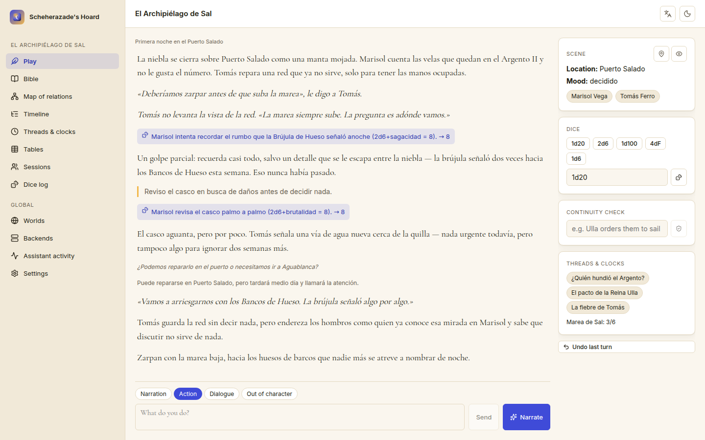

#  Scheherazade's Hoard
### Who's alive? Who's where? What have you promised them?
**A world-state and continuity keeper for interactive fiction and tabletop play — it remembers everything a language model forgets, and hands the narrator exactly the slice it needs for the next scene.**

[Español](README.es.md) · [Run locally](#run-locally-on-windows) · [Connect an AI](docs/MCP.md) · [Portfolio](https://luissalet.github.io/Portfolio/#projects)


*Actual application, demo data ("El Archipiélago de Sal", an original setting seeded by `--demo`).*

## Why

Language models are good narrators and terrible continuity editors. After
an hour of interactive fiction or a tabletop session they forget who knows
what, resurrect dead characters, move towns, lose the plot threads and
fudge dice. Scheherazade keeps the **world state outside the model** —
entities, relationships, secrets, places, a chronology, open threads,
clocks, tables and an audited dice log — and builds the narrator a
compact, ranked, budget-bound brief for the next scene, then records what
that scene actually changed. It can narrate on its own with a shared
local model, or hand its tools to another AI (Faustus) so that AI
narrates while this app remembers everything.

## What is implemented

| Area | Available now | Boundary |
| --- | --- | --- |
| World state | Entities (character/location/faction/item/lore/creature) with aliases, stats and GM secrets, relations, facts with provenance and a canon flag, timeline, threads, clocks, random tables; SQLite + FTS5 with accent-insensitive search | One local writer; no multi-user editing |
| Dice | `NdM`, `+/-`, `kh/kl/dh/dl`, exploding `!`, `adv(d20)`/`dis(d20)`, `dF`; seeded reproducibility; every roll in an append-only log; with a world, 2d6 rolls get their PbtA band and d20 rolls their natural value and crit | Bounded on purpose (200 dice per roll, 100 characters per expression) |
| Context builder | `world_context()`: premise, content boundaries, current scene and cast, ranked facts, live threads, clocks at least half full and recent turns, each line with a citable id, within a character budget | Ranking is lexical and rule-based, not embedding search |
| Delta engine | Validation per item, then the delta and its turn in one SQLite transaction; the scene carries over between turns; undo walks back turn by turn within the current session | No redo; turns of an earlier session cannot be undone |
| Narrator (standalone) | Builds the prompt, calls the shared model through Hoard Link, separates narration from the delta (fenced JSON, bare objects, trailing-comma repair), and lets you accept or reject each proposed change | Not streamed: one reply, with a spinner |
| Consistency check | Rules for a dead character acting, a character placed away from where they were last seen and a contradicted relation (whole-word, alias-aware), plus an LLM judge over matching facts that must cite fact ids; the result says whether the judge ran | Heuristics: it misses contradictions that no rule covers and no fact states |
| Export | Session as a Markdown chapter, optionally polished by the shared model (falls back to the plain chapter and says why), world bible in Markdown, full JSON export and import | Polish is instructed not to add facts but is not checked against the source; chapters over 6000 characters are not polished |
| Illustrations | "Illustrate" calls Prospero's Hoard's agent API when it answers on 127.0.0.1:8815; the button is hidden otherwise | Needs that separate app; the image is shown, not stored on the turn |
| Shared model backend | Hoard Link vendored unmodified (`scheherazades_hoard/hoard_link/`): explicit settings, then Faustus's model registry, then resident models on loopback (llama.cpp, Ollama, OpenAI-compatible); Settings shows the reason, can clear overrides and never returns the token | Only the language-model capability is used; the app never loads a model itself |
| UI | Play, Bible, Map of relations (SVG), Timeline, Threads & clocks (kanban and segmented clocks), Tables, Sessions, Dice log, Backends, Assistant activity, Settings; a continuity check box in Play; accent-insensitive Bible search; Spanish and English, light and dark | The map uses a fixed circular layout, not a physics simulation |

## Connect it to Faustus

The app declares itself with `faustus-plugin.json`. Start the app, then in
Faustus: **Connectors → Nearby apps → Add**. Faustus finds it by scanning
loopback ports and reading that manifest.

Two ways to play, same world: connected, Faustus is the narrator and uses
the tools below (the `narrator-loop` skill tells it in which order); on
its own, the app narrates with the model Faustus already has loaded,
found through Hoard Link, so nothing is loaded twice.

| Tool | Read-only | What it does |
| --- | --- | --- |
| `story_worlds()` | yes | List every world with counts and current session |
| `story_world_create(...)` | no | Create a new world |
| `world_context(world, ...)` | yes | The narrator's brief for the next scene |
| `world_search(world, query, ...)` | yes | Search entities/facts |
| `entity_get(world, ref, ...)` | yes | One entity with relations and facts |
| `entity_upsert(world, kind, name, ...)` | no | Create or update an entity |
| `story_append(world, text, ...)` | no | Record a turn and apply a delta, atomically |
| `dice_roll(expression, ...)` | no | Roll dice with an audited log |
| `table_roll(world, table)` | no | Roll on a random table |
| `thread_update(world, thread, ...)` | no | Advance/resolve/abandon a thread |
| `clock_tick(world, clock, ticks=1)` | no | Advance a clock |
| `world_check(world, statement)` | yes | Check a statement against established facts |
| `session_export(world, ...)` | yes | Export a chapter / the bible / full JSON, a page at a time |
| `story_undo(world)` | no | Revert the last turn and everything its delta changed |

Full argument lists, return shapes and limits: [`docs/MCP.md`](docs/MCP.md).

It also works with any other MCP client over stdio:

```json
{
  "mcpServers": {
    "scheherazade": {
      "command": "/absolute/path/to/scheherazades-hoard/.venv/Scripts/python.exe",
      "args": ["/absolute/path/to/scheherazades-hoard/scheherazades_hoard/mcp_server.py"],
      "env": { "SCHEHERAZADE_URL": "http://127.0.0.1:8816" }
    }
  }
}
```

## Run locally on Windows

Double-click **`Iniciar Scheherazade's Hoard.cmd`**. It runs
`scripts/start.ps1`, which finds Python 3.11 or newer, creates `.venv`
and installs `requirements-lock.txt` (again whenever the lock changes),
builds the interface if `frontend/dist` is missing (Node 22 is needed
only then), starts the app with the repo root as working directory, waits
for `/api/health` and opens the browser. If the app is already running it
only opens the browser. Stop it with **`Detener Scheherazade's Hoard.cmd`**
(`scripts/stop.ps1`), which also stops an instance Faustus started.

Manual steps, from the repo root, in PowerShell:

```powershell
python -m venv .venv
.venv\Scripts\python.exe -m pip install -r requirements-lock.txt
cd frontend; npm ci; npm run build; cd ..
.venv\Scripts\python.exe -m scheherazades_hoard --demo
```

`--demo` uses a synthetic seeded world in `data-demo/` instead of your
real `data/`, so you can try everything without touching (or needing) any
real data. Drop `--demo` for your own worlds; add `--no-browser` to skip
the automatic tab.

## Architecture

Modules, data model, the atomic delta engine, and the decisions behind
them: [`docs/ARCHITECTURE.md`](docs/ARCHITECTURE.md).

## Tests

```
.venv\Scripts\python.exe -m pytest tests/ -q
```

240 tests, offline (no real model: Hoard Link, the narrator and the
Prospero adapter run against `httpx.MockTransport`), in about 15 seconds.
They cover the dice grammar and its bounds, ruleset readings, the context
builder's budget, ranking and secret exclusion, delta validation, the
single-transaction turn and undo (including repeated updates in one
delta), scene carry-over, JSON extraction, the consistency rules,
accent-insensitive search, exports and import, the static file server
against path traversal, the Host/Origin guard, the CLI start with its pid
file and log, and an MCP protocol test that spawns the real adapter over
stdio against a live instance (`list_tools`, annotations, Keywords lines,
and a create, roll, append, context and undo round trip).

`npm run build` (inside `frontend/`) runs `tsc -b && vite build` with
TypeScript strict mode, `noUnusedLocals` and `noUnusedParameters` on.

## Privacy and limits

- Binds `127.0.0.1` only, rejects other Host headers and cross-site
  writes, and refuses to be framed by web pages. No telemetry. The only
  network calls are to model servers on your machine (or the Faustus you
  configured) and to Prospero's Hoard, both on loopback.
- Your worlds live in `data/` (gitignored) as one SQLite file; the log is
  `data/logs/app.log` and records tool names and timings, never story
  text, secrets or tokens.
- Agent tools never return GM secrets unless asked with
  `include_secrets=true`; "Assistant activity" lists every agent call,
  and your own clicks in the interface are kept out of it.
- The narrator's structured output is parsed from free text; a reply
  that cannot be parsed is kept as narration marked `unparsed`, never
  guessed at.
